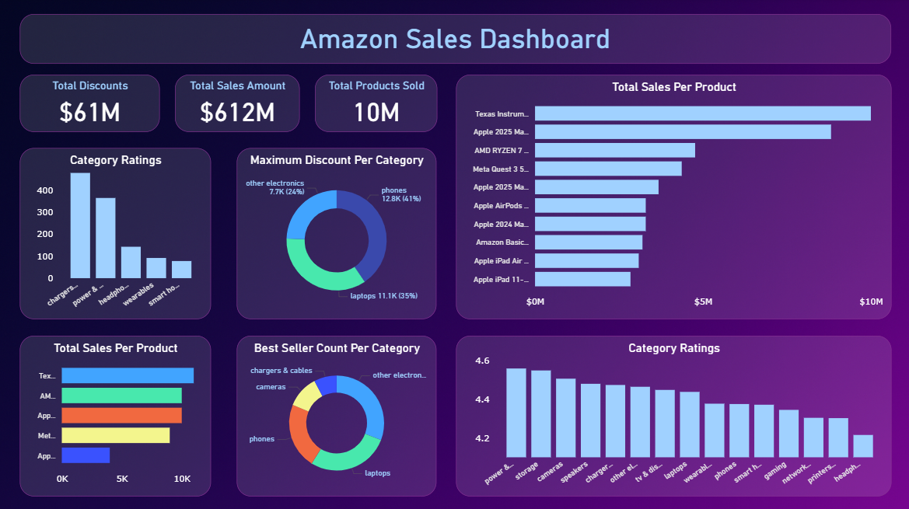

# Amazon Sales ETL Pipeline (PySpark + PostgreSQL) with Dashboard

A production‑style **ETL pipeline** that extracts Amazon product sales data from **PostgreSQL**, cleans and standardizes it with **PySpark**, and writes a curated dataset back to PostgreSQL. The repo includes a **PowerBI dashboard** (at the end) for exploring KPIs, trends, and product performance.

---

## ✨ Highlights

- **PySpark ETL** with clear, opinionated data quality rules.
- **JDBC I/O**: PostgreSQL ➜ Spark DataFrame ➜ PostgreSQL (cleaned table).
- **Curated sample CSV** for quick analytics & the dashboard.
- **PowerBI dashboard** to visualize insights (KPIs, filters, charts).

---

## ⚙️ Tech Stack
- **Python 3.9+**
- **PySpark** for distributed data processing
- **PostgreSQL** for relational storage
- **Power BI** for visualization
- **JDBC Driver** for Spark-Postgres connectivity

---

## 📊 Amazon Sales Dashboard

### Overview
This dashboard provides a comprehensive view of Amazon's sales performance after the ETL process. It highlights:

- **Total Discounts**: $61M  
- **Total Sales Amount**: $612M  
- **Total Products Sold**: 10M  

The visualizations include:
- Category Ratings
- Maximum Discount per Category
- Total Sales per Product
- Best Seller Count per Category
- Detailed Category Ratings

